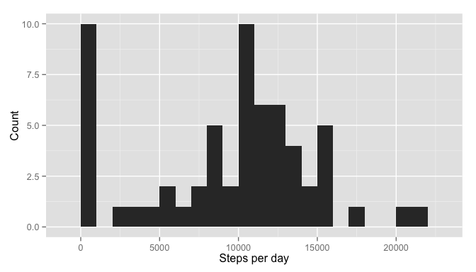
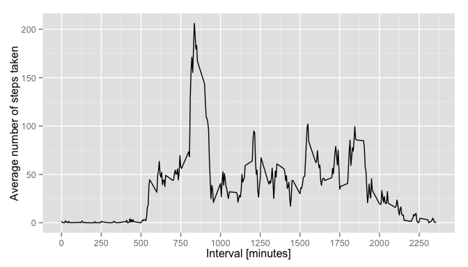
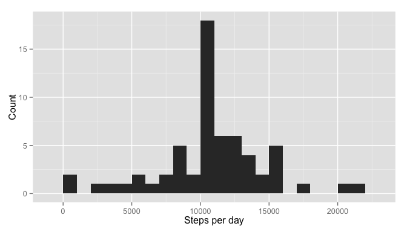

# Reproducible Research: Peer Assessment 1
E.A.D.  

## Introduction
Welcome to the RMarkdown document for the first Peer Assessment of the course "Reproducible Research" from Coursera. This document will describe the steps taken for the data analysis and include code chunks to generate the output necessary for answering the questions.

Since this is not supposed a CodeBook or a README, the data and variables will not be further described. If you want to have a description of the data, please access [this page](https://class.coursera.org/repdata-011/human_grading/view/courses/973512/assessments/3/submissions).

## Loading necessary packages

This analysis will require some external packages: **ggplot2**, **plyr**, and **data.table**. Load them with the **library** command.


```r
library(plyr)
library(ggplot2)
```


## Loading and preprocessing the data

Set the working directory to the folder where the data file **activity.zip** is located using the **set.wd("...")** command in R. The next code chunk unzips the data into the csv file and reads the data into the R environment, it is saved as the variable *data*:


```r
unzip("activity.zip")
data <- read.csv("activity.csv")
```

Let's have a look at the data:


```r
dim(data)
```

```
## [1] 17568     3
```

```r
head(data)
```

```
##   steps       date interval
## 1    NA 2012-10-01        0
## 2    NA 2012-10-01        5
## 3    NA 2012-10-01       10
## 4    NA 2012-10-01       15
## 5    NA 2012-10-01       20
## 6    NA 2012-10-01       25
```

```r
tail(data)
```

```
##       steps       date interval
## 17563    NA 2012-11-30     2330
## 17564    NA 2012-11-30     2335
## 17565    NA 2012-11-30     2340
## 17566    NA 2012-11-30     2345
## 17567    NA 2012-11-30     2350
## 17568    NA 2012-11-30     2355
```

So we know we have three variables: the number of steps taken, the day of the measurement and the interval identifier. The interval identifier is actually the hour and minute of the measurement, i.e. 2355 corresponds to 23:55. It is not really necessary to convert this column to a time format, so let's leave it as it is. We can already see that there are a couple of NA's there too. There are a total of 17568 observations.

Let's check what is the class of the date column:
 

```r
class(data$date)
```

```
## [1] "factor"
```

It seems that the date column is saved as a factor. Let's transform that to a Date type:


```r
data$date <- as.Date(data$date, format = "%Y-%m-%d")
head(data$date)
```

```
## [1] "2012-10-01" "2012-10-01" "2012-10-01" "2012-10-01" "2012-10-01"
## [6] "2012-10-01"
```

```r
class(data$date)
```

```
## [1] "Date"
```

That looks better now. We can move to the next question.

## What is mean total number of steps taken per day?

In order to answer this question, we need the sum of total steps taken during each day. Here we can apply plyr's **ddply** function to apply the function **sum** to each day. Since we can ignore the missing values, let's just remove them from the set using **na.rm**:


```r
daily_steps_sum <- ddply(data, .(date), function(x) sum(x$steps, na.rm = TRUE))
names(daily_steps_sum) <- c("date", "total_steps")
head(daily_steps_sum)
```

```
##         date total_steps
## 1 2012-10-01           0
## 2 2012-10-02         126
## 3 2012-10-03       11352
## 4 2012-10-04       12116
## 5 2012-10-05       13294
## 6 2012-10-06       15420
```

The data frame *daily_steps_sum* has the sum of steps for each day. We can now use a histogram to check the frequency of steps taken during different days.


```r
qplot(total_steps, data = daily_steps_sum, geom = "histogram", xlab = "Steps per day", ylab = "Count", binwidth = 1000) + scale_x_continuous(limits = c(0, 22000))
```

 

It seems that there are many days where very few steps or none at all were measured. For the next step we can calculate the mean and the median of steps taken during each day (for each day). We can use **ddply** again, just changing the function that will be applied for each day:


```r
daily_steps_mean <- ddply(data, .(date), function(x) mean(x$steps, na.rm = TRUE))
names(daily_steps_mean) <- c("date", "mean_steps")
head(daily_steps_mean)
```

```
##         date mean_steps
## 1 2012-10-01        NaN
## 2 2012-10-02    0.43750
## 3 2012-10-03   39.41667
## 4 2012-10-04   42.06944
## 5 2012-10-05   46.15972
## 6 2012-10-06   53.54167
```

```r
daily_steps_median <- ddply(data, .(date), function(x) median(x$steps, na.rm = TRUE))
names(daily_steps_median) <- c("date", "median_steps")
head(daily_steps_median)
```

```
##         date median_steps
## 1 2012-10-01           NA
## 2 2012-10-02            0
## 3 2012-10-03            0
## 4 2012-10-04            0
## 5 2012-10-05            0
## 6 2012-10-06            0
```

The median is not very useful in this case, since there are so many measurements where no steps were taken. The median is therefore always 0 for these days.

We can nevertheless just take the mean and median of all days:


```r
mean(daily_steps_sum$total_steps)
```

```
## [1] 9354.23
```

```r
median(daily_steps_sum$total_steps)
```

```
## [1] 10395
```

## What is the average daily activity pattern?

In order to study the average daily activity pattern let's firstly apply the average function to each daily 5-minute interval. We can do that using **ddply** again:


```r
activity <- ddply(data, .(interval), function(x) mean(x$steps, na.rm = TRUE))
names(activity) <- c("interval", "average_steps")
```

Now that we have this data, we can create a line plot of the intervals and the average of number steps taken:


```r
qplot(interval, average_steps, data = activity, geom = "line", xlab = "Time of the day", ylab = "Average number of steps taken") + scale_x_continuous(limits = c(0, 2355), breaks = seq(0, 2355, 250))
```

 

From the graph we can alrady see that most steps were taken between the intervals 750 and 1000, therefore between 7:50 and 10:00. We can calculate the 5-minute interval with the maximum number of steps with the **which.max** function to index the activity data table:


```r
activity[which.max(activity$average_steps), ]
```

```
##     interval average_steps
## 104      835      206.1698
```

So, in the interval **835**, which corresponds to 8:35, the maximum average_steps of around **206** was measured over all days.

## Imputing missing values

As we noticed earlier, there are some missing values (NA's) in this data set. Let's calculate exactly how many rows have missing values:


```r
length(which(is.na(data$steps)))
```

```
## [1] 2304
```

There are **2304** rows with missing values. Let's do something about that. I would say it makes sense to substitute the NA's with the average of the steps taken from the same 5-minute interval. We have this information already stored in the **activity** data set.

Firstly, we can create another column in the data set which has the average number of steps per day. We can use the **merge** function to merge the **activity** data set to the main data. This will be a new data set:


```r
complete_data <- merge(activity, data, by = "interval")
head(complete_data)
```

```
##   interval average_steps steps       date
## 1        0      1.716981    NA 2012-10-01
## 2        0      1.716981     0 2012-11-23
## 3        0      1.716981     0 2012-10-28
## 4        0      1.716981     0 2012-11-06
## 5        0      1.716981     0 2012-11-24
## 6        0      1.716981     0 2012-11-15
```

It looks good, but it seems that the order of the rows has been changed, let's arrange this:


```r
complete_data <- arrange(complete_data, date)
head(complete_data)
```

```
##   interval average_steps steps       date
## 1        0     1.7169811    NA 2012-10-01
## 2        5     0.3396226    NA 2012-10-01
## 3       10     0.1320755    NA 2012-10-01
## 4       15     0.1509434    NA 2012-10-01
## 5       20     0.0754717    NA 2012-10-01
## 6       25     2.0943396    NA 2012-10-01
```

Much better. Now we can substitute the NA's by the average values. There are many ways to do that, but we can simply assign the average steps to the missing values by indexing them:


```r
indices <- is.na(complete_data$steps)
complete_data$steps[indices] <- complete_data$average_steps[indices]
head(complete_data)
```

```
##   interval average_steps     steps       date
## 1        0     1.7169811 1.7169811 2012-10-01
## 2        5     0.3396226 0.3396226 2012-10-01
## 3       10     0.1320755 0.1320755 2012-10-01
## 4       15     0.1509434 0.1509434 2012-10-01
## 5       20     0.0754717 0.0754717 2012-10-01
## 6       25     2.0943396 2.0943396 2012-10-01
```

```r
length(which(is.na(complete_data$steps)))
```

```
## [1] 0
```

So, all NA's were substituted for the average number of steps taken in the same interval over all measured days. Let's see how this affects the calculations that we've made already.

Firstly, we can examine the total number of steps taken each day using an histogram. We can repeat the same calculations made for the second step:


```r
daily_steps_sum2 <- ddply(complete_data, .(date), function(x) sum(x$steps))
names(daily_steps_sum2) <- c("date", "total_steps")
qplot(total_steps, data = daily_steps_sum2, geom = "histogram", xlab = "Steps per day", ylab = "Count", binwidth = 1000) + scale_x_continuous(limits = c(0, 22000))
```

 

The difference is quite clear. We can observe that the count for 0 steps has greatly reduced and the frequency for steps around 10,000 has increased. Let's check how our imputing has changed the mean and median values for **all** days:


```r
mean(daily_steps_sum2$total_steps)
```

```
## [1] 10766.19
```

```r
median(daily_steps_sum2$total_steps)
```

```
## [1] 10766.19
```

Make a histogram of the total number of steps taken each day and Calculate and report the mean and median total number of steps taken per day. Do these values differ from the estimates from the first part of the assignment? What is the impact of imputing missing data on the estimates of the total daily number of steps?

## Are there differences in activity patterns between weekdays and weekends?
